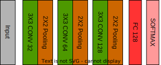

## Gesture Model

This deep learning model is designed for gesture detection, specifically to classify hand gestures into four different categories: "down," "neutral," "up," and "other." The model is trained to recognize these gestures based on input images that have been preprocessed and converted into numerical data.
Data Preprocessing

Before training the model, the image data is loaded from the specified folders for each category ("down," "neutral," "up," and "other"). The images are then resized to a standard size of 50x50 pixels to ensure consistency. The pixel values of the images are normalized to a range between 0 and 1, which helps in enhancing the training process and convergence of the model.
Model Architecture

### Architecture

The deep learning model follows a convolutional neural network (CNN) architecture, which is well-suited for image recognition tasks. The model consists of several layers, including:

- Convolutional Layers: The model starts with three convolutional layers, each having 32, 64, and 128 filters, respectively. These layers are responsible for extracting essential features from the input images.

- Max Pooling Layers: After each convolutional layer, a max-pooling layer is added. These layers downsample the spatial dimensions of the feature maps, reducing computational complexity and enhancing the model's ability to generalize.

- Flatten Layer: Following the convolutional layers, a flatten layer is used to convert the multidimensional feature maps into a one-dimensional vector, which is then fed into the fully connected layers.

- Dense Layers: Two dense layers are employed in the model. The first dense layer has 128 neurons with ReLU activation, helping the model learn complex patterns from the extracted features. The final dense layer has neurons equal to the number of gesture categories, with a softmax activation function to provide probabilities for each class.

### Model Compilation and Training

The model is compiled using the "adam" optimizer and the categorical cross-entropy loss function, which is suitable for multiclass classification problems. The training is performed over 20 epochs with a batch size of 32. During training, the model optimizes its weights and biases to minimize the loss and improve accuracy on the training data. Additionally, a validation set (20% of the training data) is used to monitor the model's performance and prevent overfitting.
Model Evaluation

### Evaluation

Once the training is complete, the model is evaluated on a separate test dataset, which was not used during training. The test dataset is preprocessed in the same way as the training data, and its performance is measured using the previously compiled model. The evaluation metrics include the loss and accuracy, providing insights into how well the model generalizes to unseen data.