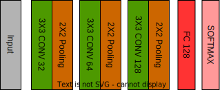

# Gesture-Scroll


[](https://www.python.org/)
[](./LICENSE)
[](https://github.com/psf/black)

### Accessibity tool for scrolling pages using hand-gestures


This project aims to create a groundbreaking gesture-based accessibility tool that enables users to interact with digital devices and applications effortlessly through hand gestures. By incorporating computer vision techniques, developed an innovative solution to address accessibility needs and enhance the overall user experience.


## Getting Started

To get started with the gesture-based accessibility tool, you will need the following:

* A computer with a webcam
* Python 3

Once you have installed the necessary requirements, you can follow the steps below to run the tool:

1. Clone the repository to your computer.
2. Open a terminal window and navigate to the directory where you cloned the repository.
3. Run the following command to start the tool:
```bash
pip install -r requirements.txt
cd Models
python scroller.py
```
OR

3. Run
```bash
chmod +x run.sh
./run.sh
```

The tool will now start and will be listening for hand gestures. To perform an action, simply make the corresponding gesture in front of the webcam. For example, to scroll up, make a scrolling gesture with your index finger.

4. To exit the tool, press `Escape` key.

## How to Use

1. Launch the application.  
2. Position your hand in front of the webcam to trigger hand detection.
3. Perform hand gestures to control scrolling:
    - "Up" gesture: Scrolls the screen upwards.
    - "Down" gesture: Scrolls the screen downwards.
    - Other gestures: No scrolling action is performed.
4. The predicted gesture label will be displayed on the screen for each detected gesture.
5. To exit the application, press the "Esc" key.


## Troubleshooting
If you are having trouble getting the tool to work, please refer to the following 
Troubleshooting tips:

Make sure that your webcam is properly connected to your computer.
Make sure that the dependencies are installed correctly.
Try restarting your computer.
If you are still having trouble, please open an issue on the GitHub repository.

## Key Features

* **Advanced gesture recognition:** The tool utilizes a custom-built deep learning model to accurately recognize a wide range of hand gestures, including scroll up, scroll down. The model has been trained on diverse and annotated data, ensuring reliable and precise recognition.
* **Seamless hand detection:** Leveraging the capabilities of Mediapipe, we enable real-time hand detection, allowing users to interact with their devices simply by presenting their hand in the camera frame. This eliminates the need for additional hardware, making our tool accessible to a broader audience.
* **Robustness and real-time performance:** The system has been fine-tuned for robustness, making it adaptive to various hand poses, lighting conditions, and different hand sizes. Users can experience seamless and real-time interactions, ensuring a smooth and responsive experience.

## Applications

* **Accessibility assistance:** The gesture-scroll accessibility tool serves as a valuable resource for individuals with mobility challenges. By providing an alternative means of interaction, users can navigate web pages, documents, and applications effortlessly through hand gestures.
* **Presentation and public interaction:** The tool is particularly useful for presenters, educators, and public speakers who can use gestures to control slides and content during presentations, without being bound to a physical device.

## Conclusion

The Gesture-scroll accessibility tool presents an innovative and powerful solution to revolutionize how users interact with digital devices. By combining custom-built deep learning for gesture recognition with hand detection using Mediapipe, we have created an intuitive and accessible tool for users of all backgrounds. With a vision for continuous improvement and a focus on enhancing accessibility, we are dedicated to creating a positive impact on the lives of our users.

## Learn More
- To learn more about the working of this tool. Read the <a href="./Docs/Docs.md"> Documentation </a> here
-  <br>
- For more information regarding the model used and how it works, please open the <a href="./Docs/gesture-model.md">Gesture Model</a> document.

## License
The gesture-based accessibility tool is licensed under the Apache License.

## Contact
If you have any questions or feedback, please contact us at mohdansah10@gmail.com
